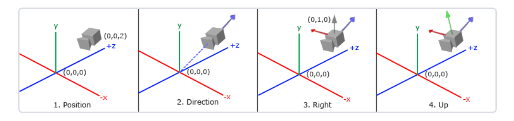
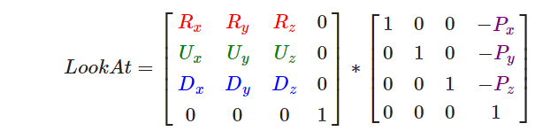
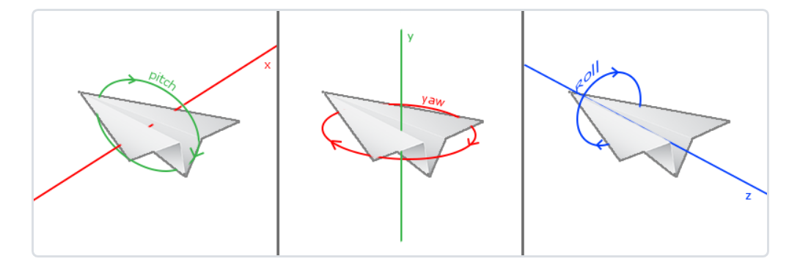
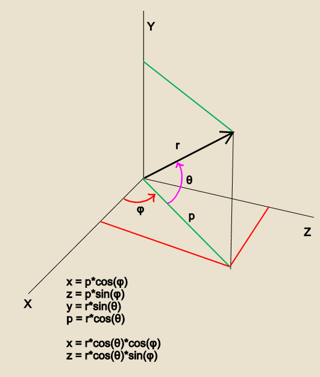

---

---

# OpenGL学习笔记

#### 1.你好，窗口

**opengl渲染流程：**

​	*初始化窗口->联系上下文->glad控制opengl指针->（渲染中）事件处理->渲染->置换前后缓冲区->渲染结束*

**疑问：**

​	*glviewport()是否在渲染具体画面上时才能生效?*

​	没错是的。

**代码：**

```
int main(int argc, char* argv[])
{
	//初始化
	if (glfwInit() == -1)
	{
		return -1;
	}
	//创建主窗口
	GLFWwindow* window = glfwCreateWindow(1200, 800, "learnOpenGL", NULL, NULL);
	if (window == NULL)
	{
		std::cout << "failed to create Window!" << std::endl;
		glfwTerminate();
		return -1;
	}
	//联系上下文
	glfwMakeContextCurrent(window);

	// 设置ImGui上下文.
	IMGUI_CHECKVERSION();
	ImGui::CreateContext();
	ImGuiIO& io = ImGui::GetIO(); (void)io;

	//设置颜色风格
	ImGui::StyleColorsDark();

	// Setup Platform/Renderer bindings
	ImGui_ImplGlfw_InitForOpenGL(window, true);
	ImGui_ImplOpenGL3_Init();

	ImVec4 clear_color = ImVec4(0.45f, 0.55f, 0.60f, 1.00f);

	//设置GLAD管理OpenGL指针
	gladLoadGLLoader(GLADloadproc(glfwGetProcAddress));

	//视口设置
	glViewport(0, 0, 100, 50);

	//设置窗口大小改变回调函数
	glfwSetFramebufferSizeCallback(window, framebuffer_size_callback);

	//Render Loop
	while (!glfwWindowShouldClose(window))
	{

		// Start the Dear ImGui frame 启动IMgui Frame框架.
		ImGui_ImplOpenGL3_NewFrame();
		ImGui_ImplGlfw_NewFrame();
		ImGui::NewFrame();
```

​	
​			

```
			{
   				static float f = 0.0f;
   				static int counter = 0;
   	
```


   	                ImGui::Begin("Hello, world!");                          // Create a window called "Hello, world!" and append into it.
   	
   	                ImGui::Text("This is some useful text.");               // Display some text (you can use a format strings too)
   	                //ImGui::Checkbox("Demo Window", &show_demo_window);      // Edit bools storing our window open/close state
   	                //ImGui::Checkbox("Another Window", &show_another_window);
   	
   	                ImGui::SliderFloat("float", &f, 0.0f, 1.0f);            // Edit 1 float using a slider from 0.0f to 1.0f
   	                ImGui::ColorEdit3("clear color", (float*)&clear_color); // Edit 3 floats representing a color
   	
   	                if (ImGui::Button("Button"))                            // Buttons return true when clicked (most widgets return true when edited/activated)
   	                    counter++;
   	                ImGui::SameLine();
   	                ImGui::Text("counter = %d", counter);
   	
   	                ImGui::Text("Application average %.3f ms/frame (%.1f FPS)", 1000.0f / io.Framerate, io.Framerate);
   	                ImGui::End();
   	            }
   	
   			// 3. Show another simple window.
   	
   			// Rendering
   			ImGui::Render();
   	
   			processInput(window);
   			glfwSwapBuffers(window);
   			glfwPollEvents();
   			glClearColor(clear_color.x * clear_color.w, clear_color.y * clear_color.w, clear_color.z * clear_color.w, clear_color.w);
   			glClear(GL_COLOR_BUFFER_BIT);
   	
   			ImGui_ImplOpenGL3_RenderDrawData(ImGui::GetDrawData()); //必须在绘制完Open之后接着绘制Imgui
   																	//glUseProgram(last_program);
   		}
   	
   		// Cleanup
   		ImGui_ImplOpenGL3_Shutdown();
   		ImGui_ImplGlfw_Shutdown();
   		ImGui::DestroyContext();
   	
   		glfwTerminate();
   		return 0;
   	}

#### 2.你好，三角形

顶点数组对象VAO，顶点缓冲对象VBO，元素缓冲对象EBO

渲染一个三角形流程：定义VAO,VBO,EBO->绑定VAO,VBO,EBO->解绑->再绑定不同的VAO,VBO,EBO->渲染

##### （1）定义VAO

```
unsigned int VAOS[2];
glGenVertexArrays(2, VAOS);
```

##### （2）定义VBO,EBO

```
unsigned int VBOS[2];
glGenBuffers(2, VBOS);
unsigned int EBO;
glGenBuffers(1, &EBO);
```

##### （3）绑定

```
glBindVertexArray(VAO[0]);
//缓冲类型绑定
glBindBuffer(GL_ARRAY_BUFFER, VBO[0]);

//将顶点数据绑定到缓冲对象
glBufferData(GL_ARRAY_BUFFER, sizeof(vertices), vertices, GL_STATIC_DRAW);

//设置顶点属性指针
glVertexAttribPointer(0, 3, GL_FLOAT, GL_FALSE, 3 * sizeof(GL_FLOAT), (void*)0);
glEnableVertexAttribArray(0);
```

##### （4）索引绑定

```
glBindVertexArray(VAO[1]);
//缓冲类型绑定
glBindBuffer(GL_ARRAY_BUFFER, VBO[1]);
glBufferData(GL_ARRAY_BUFFER, sizeof(vertices1), vertices1, GL_STATIC_DRAW);
glBindBuffer(GL_ELEMENT_ARRAY_BUFFER, EBO);
glBufferData(GL_ELEMENT_ARRAY_BUFFER, sizeof(indices), indices, GL_STATIC_DRAW);
glVertexAttribPointer(0, 3, GL_FLOAT, GL_FALSE, 3 * sizeof(GL_FLOAT), (void*)0);
glEnableVertexAttribArray(0);
```

##### （5）解绑

```
glBindBuffer(GL_ARRAY_BUFFER, 0);
glBindVertexArray(0);
```

##### （6）渲染

```
glBindVertexArray(VAO[0]);
glDrawArrays(GL_TRIANGLES, 0, 3);
//glBindVertexArray(0);
glBindVertexArray(VAO[1]);
glDrawElements(GL_TRIANGLES, 6, GL_UNSIGNED_INT, 0);
//glBindVertexArray(0);
```

#### 3.着色器

##### （1）shader类型

​	顶点着色器，片段着色器(分别简写为vshader,fshader)

​	vshader负责将顶点属性作为输入进行变换然后传递给GPU，fshader负责控制颜色。

##### （2）shader常用语法

```
in vec3 my_color;#作为输入
out vec4 out_color;#作为输出
uniform vec3 uni_color;#类似于变量，可以通过程序改变
layout (location = 0) in vec3 aPos;#将顶点属性aPos放到位置0处
```

##### （3）一个简单的Shader

```
#version 330 core
layout (location = 0) in vec3 aPos;
layout (location = 1) in vec4 my_color;
uniform vec4 clear_color;
uniform vec2 offset;
out vec4 our_color;
void main()
{
    gl_Position = vec4(aPos.x + offset.x, aPos.y - offset.y, aPos.z, 1);
	our_color = my_color;
};
```

##### （4）如何使用Shader

​	编译着色器->创建着色器程序->链接->使用着色器程序->删除着色器

```
//编译着色器
unsigned int vshader;
vshader = glCreateShader(GL_VERTEX_SHADER);
glShaderSoure(vertex, 1, &soureCode, NULL);
glCompileShader(vshader);
//创建着色器程序
unsigned int ID = glCreateProgram();
//链接
glAttachShader(ID, vshader);
glAttachShader(ID, fshader);
//使用着色器程序
glUseProgram(ID);
//删除着色器,后续只会使用到着色器程序
glDeleteShader(vshader);
glDeleteShader(fshader);
```

##### （5）不同的物体使用不同的着色器绘制时

​	先使用着色器程序再绘制，否则绘制的是最近的那个着色器程序。

#### 4.纹理

##### （1）添加纹理流程

​	创建纹理->绑定纹理->设置纹理->生成纹理->使用纹理

```
//记得在显示图片前翻转图片，因为opengl y轴坐标方式与图片y轴坐标方式不一致,opengl认为0,0因该在图片的底部，而图片认为是在顶部
stbi_set_flip_vertically_on_load(true);

//创建纹理
unsigned int textures[2];
glGenTextures(2, textures);

//绑定纹理
glBindTexture(GL_TEXTURE_2D, textures[0]);

//设置纹理
glTexParameteri(GL_TEXTURE_2D, GL_TEXTURE_WRAP_S, GL_REPEAT);
glTexParameteri(GL_TEXTURE_2D, GL_TEXTURE_WRAP_T, GL_REPEAT);
glTexParameteri(GL_TEXTURE_2D, GL_TEXTURE_MIN_FILTER, GL_LINEAR);
glTexParameteri(GL_TEXTURE_2D, GL_TEXTURE_MAG_FILTER, GL_LINEAR);

//生成纹理
#define STB_IMAGE_IMPLEMENTATION
#include "stb_image.h"
int width, height, nrChannels;
unsigned char *data = stbi_load("./39.jpg", &width, &height, &nrChannels, 0);
if (data)
{
    glTexImage2D(GL_TEXTURE_2D, 0, GL_RGB, width, height, 0, GL_RGB, GL_UNSIGNED_BYTE, data);
    glGenerateMipmap(GL_TEXTURE_2D);
}

//释放内存
stb_image_free(data);

//使用纹理，如果设置纹理单元，需激活纹理单元
glActiveTexture(GL_TEXTURE0);
glBindTexture(GL_TEXTURE_2D, textures[0]);
glActiveTexture(GL_TEXTURE1);
glBindTexture(GL_TEXTURE_2D, textures[1]);

int index1[1] = { 0 };
int index2[1] = { 1 };
rtshader->setInt("texture1", index1, 1);
rtshader->setInt("texture2", index2, 1);
```

##### （2）纹理单元

​	一个物体可能不止拥有一个纹理，如果当一个物体设置了多个纹理的时候，就需要用到纹理单元，首先来看下使用纹理的片段着色器shader:

```
#version 330 core
out vec4 FragColor;
uniform vec4 clear_color;
uniform vec2 mixseed;
in vec2 out_texture;
uniform sampler2D texture1;
uniform sampler2D texture2;
void main()
{
   FragColor = mix(texture(texture1, out_texture) * clear_color, texture(texture2, out_texture) * clear_color, mixseed.x);
}
```

​	我们定义了两个纹理单元texture1,texture。当纹理单元只有一个时，我们可以不用对uniform sampler2D进行赋值，他会默认指定纹理单元为1，但当纹理不止一个时，我们需要指定纹理单元，也就是上面的rtshader->setInt("texture1", index1, 1)等;

##### （3）glPixelStorei(GL_UNPACK_ALIGNMENT, 1);

​	更改图像读取数据行对齐方式，默认对齐四字节，当图像数据字节数不是四的倍数时，有可能会加载混乱。

#### 5.变换

##### （1）向量

###### 	1.1 向量点乘

​	点乘用来求两个向量间的余弦值，通常在计算光照时用到。


###### 	1.2向量叉乘

​	叉乘用于求两个不平行向量的共同正交向量，通常用于求法线向量。


##### （2）矩阵

###### 	1.1矩阵相乘


###### 	1.2矩阵与向量相乘

​	单位矩阵：


###### 	1.3缩放


###### 	1.4平移


###### 	1.5齐次坐标

​	首先齐次坐标值第四行的坐标，它使我们的矩阵从本来的3x3矩阵变成了4x4矩阵。为什么会用到齐次坐标呢？

​	解决平移的问题：当矩阵与向量相乘时，3x3的矩阵乘以(x y z)没有问题，但当进行平移时，我们会发现z方向没地方平移了，所以我们增加了齐次坐标来满足矩阵的平移同时兼具矩阵的放大缩小。

###### 	1.6旋转


​	绕任意旋转轴(Rx,Ry,Rz)旋转：


###### 	1.7矩阵的组合

​	我们想把一个矩阵先放大两倍，然后再平移，这时候就用到了矩阵的组合。注意：在平移和缩放时，我们应该先缩放再平移，不然先平移再缩放的话，平移的距离也被缩放了

​	但在代码中，顺序应该跟其相反。

##### （3）思考

​	当我们设置视口大小不一致的时候，比如设置glfwCreateWindow(1600, 800, "learnOpenGL", NULL, NULL);viewport也与其一致，如果我们想要一个正方形的物体，顶点坐标应该怎么设置呢？如果对这个物体进行缩放，旋转，平移，是否是按照传统的移动几格x,y就加几，还是应该对其进行特殊操作呢？

​	结论:首先，如果后续没有几何变换，设置顶点坐标时就需对x,y进行变换使其单位向量相同。其次当缩放时，不影响，但当平移旋转时，我们需要对其进行操作满足对应的要求。

#### 6.坐标系统

##### （1）五个空间

###### 1.1局部空间

​	称为物体空间，一般用来表示初始给的物体顶点坐标的空间

###### 1.2世界空间

​	物体坐标经过平移缩放旋转后所处的空间，通常经过模型矩阵变换得出物体所在的世界空间

###### 1.3观察空间

​	通常用相机的视角空间来表示观察空间，将世界空间的坐标转换到观察空间的坐标，使相机能更好的观察物体

###### 1.4裁剪空间

​	在一个顶点着色器运行完后，希望所有的坐标都能在一个范围内，不在的都被裁剪掉。为了将观察空间的坐标转换到裁剪空间，我们需要用到投影矩阵进行裁剪，通常最后把所有坐标控制在标准化设备坐标(-1,1)范围内，不在的均被裁剪。

###### 1.5屏幕空间

​	把裁剪后的坐标根据视口大小变为适应视口大小的屏幕坐标

##### （2）三个矩阵

###### 2.1模型矩阵

​	用于局部空间转世界空间这一阶段，通常指物体的平移缩放旋转

###### 2.2观察矩阵

​	用于世界空间转观察空间这一阶段，通过设置观察矩阵我们可以将物体相对我们的相机满足我们想要的一个视角范围

###### 2.3投影矩阵

​	用于观察空间转到裁剪空间，我们要将坐标裁剪到指定范围内，不在范围的坐标不予显示，这就需要用到投影矩阵。投影矩阵分为正射投影，透视投影。正射投影的w分量一直为1导致透视除法没有变化，效果就是无论远近都是一样的效果，透视摄影则通过改变w分量实现透视除法达到远近的效果

##### （3）Z缓冲（深度测试）

​	openGL所有深度信息存储在Z缓冲中，当我们开启深度测试后，我们会将Z缓冲与片段的深度信息做对比，如果当前片段在其他片段后面，我们则舍弃它，不再对该片段输出颜色，否则对其覆盖。

​	如何开启及如何使用：

```
glEnable(GL_DEPTH_TEST);//启用深度测试，默认是关闭的

//每次渲染前清楚深度缓冲，否则之前的残留
while(...)
{
	glClear(GL_COLOR_BUFFER_BIT | GL_DEPTH_BUFFER_BIT);
}
```

#### 7.摄像机

##### （1）LookAt矩阵

​	通过这个矩阵我们可以将坐标变换到我们想要的观察空间中，首先LookAt矩阵由三个轴确定，方向轴，up轴和右轴，一张图片告诉我们怎么确定LookAt的三个轴：
​	

​	确定方向轴->定义一个up轴(相对世界空间)->向量叉乘得出右轴

​	得出LookAt矩阵如下图:



​	创建LookAt封装好的代码如下：

```
glm::mat4 view;
//第一个向量代表相机所处位置，第二个代表观察哪个点，他们两个用来确定方向轴，第三个向量代表上轴
view = glm::lookAt(glm::vec3(0.0f, 0.0f, 3.0f), 
           glm::vec3(0.0f, 0.0f, 0.0f), 
           glm::vec3(0.0f, 1.0f, 0.0f));
```

##### （2）视角移动

​	欧拉角分为俯仰角(pitch)，偏航角(Yaw), 滚转角(roll)。俯仰角代表从上往下看的角，偏航角代表从左往右看的角，滚转角代表如何滚转摄像机，对于自己的摄像机系统我们只关心俯仰偏航角，下面一张图可以代表三个欧拉角的含义：



​	我们通过设置LookAt矩阵的方向向量来控制相机的视角，相机的位置我们是知道的，所以我们需要确定起点的位置即观察目标的位置，如何获得呢？下面这张图可以帮助我们很好的理解：



​	从图中可以很好的确定起点位置为（x,y,z）

​	至此，我们的视角也确定好了，根据设置不同的俯仰，偏航角我们也能设置不同的视角。代码如下:

```
static glm::vec3 campos = glm::vec3(0.0f, 0.0f, 3.0f);
viewt = glm::lookAt(campos, campos + cammove, glm::vec3(0.0f, 1.0f, 0.0f));

static float pitch = 0;
static float yaw = -90.0f;//结合上面那张图我们就知道为什么初始要设初始pitch为0，yaw为-90了.它可以让我们摄像机对准z轴负方向观看

void mouse_callback(GLFWwindow* window, double x, double y)
{
	if (firstMouse)
	{
		lastx = x;
		lasty = y;
		firstMouse = false;
	}

	float xoffset, yoffset;
	float sensitivity = 0.1f;
	xoffset = x - lastx;
	//鼠标相对于窗口左上角的位置，所以需要将y - lasty 取反
	yoffset = lasty - y;
	//std::cout << yoffset << std::endl;
	lastx = x;
	lasty = y;

	pitch += yoffset*sensitivity;

	yaw += xoffset*sensitivity;

	if (pitch > 89.0f)
	{
		pitch = 89.0f;
	}
	else if (pitch < -89.0f)
	{
		pitch = -89.0f;
	}

	cammove[0] = cos(glm::radians(pitch)) * cos(glm::radians(yaw));
	cammove[1] = sin(glm::radians(pitch));
	cammove[2] = cos(glm::radians(pitch)) * sin(glm::radians(yaw));
}
```

